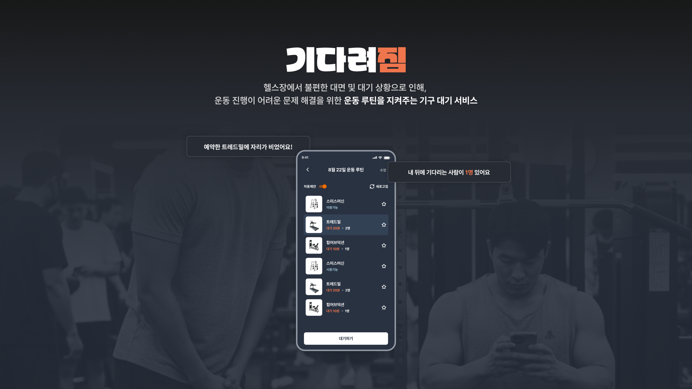
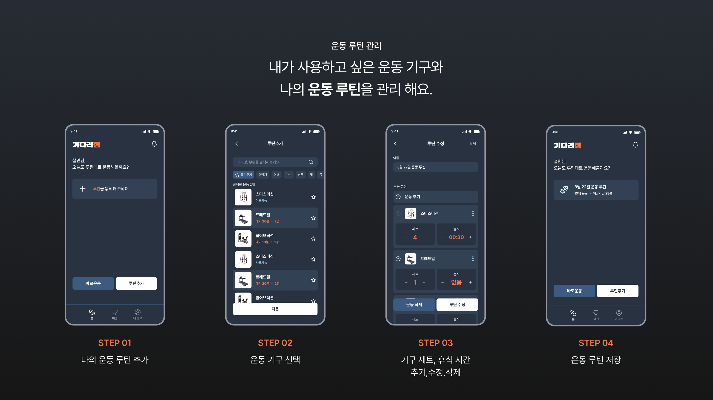
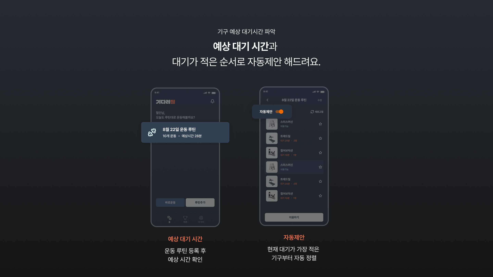
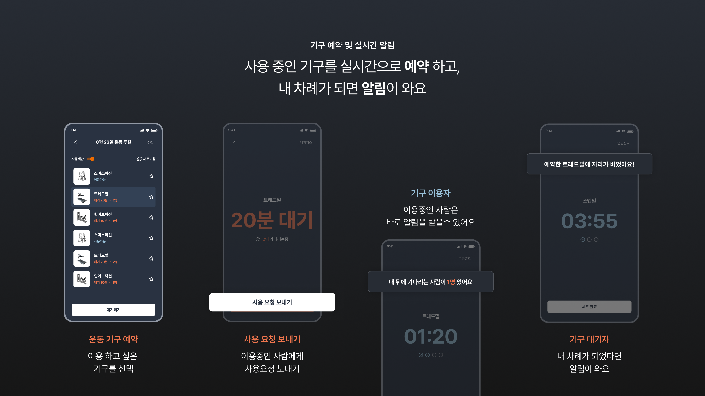
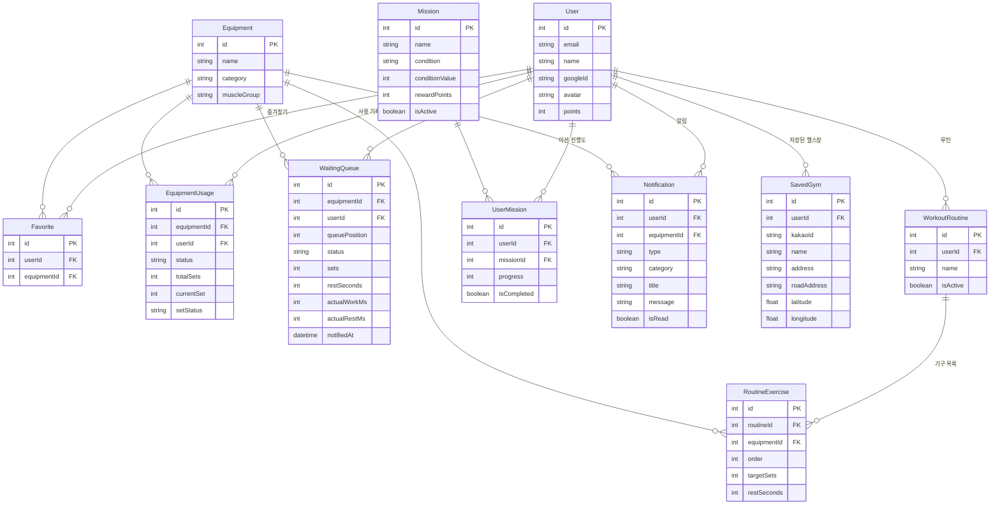

<div align="center">



[](https://react.dev/)
[](https://www.typescriptlang.org/)
[](https://waitgym.today)

[🌐 서비스 바로가기](https://waitgym.today)

---

</div>

## 📖 프로젝트 소개

헬스장에서 불편한 대면 및 대기상황으로 인해 플랜진행이 어려운 문제해결을 위한  
효율적인 플랜진행을 돕는 **기구 대기 서비스 "기다려짐"** 입니다.

기존 팀 프로젝트를 **혼자 리빌드**하며 기획/설계/디자인/개발/배포 전 과정을 직접 경험했습니다.

> 📄 [PRD (기획 문서)](./docs/PRD.md) · 📓 [개발 일지](./docs/devlog.md)

### 🎯 핵심 기능

### 1. 👤 **운동 루틴 관리**

> 내가 사용하고 싶은 운동 기구와 세트 수를 추가, 수정, 삭제해 **나의 운동 루틴**을 관리할 수 있습니다.



---

### 2. 📋 **기구 대기열 파악**

> 기구마다 **현재 대기 인원**과 **사용 현황**을 Socket.io로 실시간 갱신합니다.  
> **예상 대기시간(대기 N분)**을 USING 잔여시간 + WAITING 대기자 합산으로 계산해 표시합니다.  
> **자동 제안** 토글로 대기가 적은 기구를 우선 정렬하여 효율적인 운동 계획이 가능합니다.



---

### 3. 💺 **기구 대기 시스템**

> 사용 중인 기구를 실시간으로 대기 등록하고, 내 차례가 되면 알림을 받아 효율적으로 운동할 수 있습니다.



---

<!--
### 4. ⏱️ **세트 / 휴식 타이머**

> 세트 완료 후 휴식 타이머가 자동으로 시작됩니다.
> 루틴 현황 보기로 이탈해도 **플로팅 타이머**로 운동 흐름이 유지되며, 타이머 종료 시 운동 화면으로 자동 복귀합니다.

---

### 5. 🏆 **미션 & 랭킹**

> 운동 완료 시 총 세트 수·기구 종류·연속 출석일 기준으로 **미션 진행도가 자동 갱신**됩니다.
> 미션 달성 시 포인트를 적립하고, 전체 유저 **포인트 랭킹** 상위 10명을 확인할 수 있습니다.

---
-->

## 🛠 기술 스택

```
Frontend Framework    React 18 + TypeScript
Build Tool           Vite
State Management     Zustand
Styling              Sass (SCSS)
Animation            framer-motion
Drag & Drop          @dnd-kit
Real-time            Socket.io-client
UI Components        @mui/material
```

**선택 이유:**

- **React (vs Next.js)**: Socket.io는 지속적인 WebSocket 연결이 필요해 서버리스 모델의 Next.js와 맞지 않아 Vite + React SPA 선택

- **TypeScript**: 정적 타입 지원으로 코드 안정성 및 가독성 향상, 런타임 오류 사전 방지

- **Zustand**: 가볍고 간단한 API로 복잡한 보일러플레이트 없이 효율적인 상태 관리. 웨이팅 플로우를 상태 머신 패턴으로 모델링

- **Sass**: Tailwind CSS 대신 선택 — 세밀한 디자인 커스터마이징 요구사항 충족. 변수, 믹스인, 중첩으로 재사용 가능한 스타일 시스템 구축

- **Socket.io**: 실시간 대기열 업데이트 및 알림. ws 라이브러리 대신 선택하여 자동 재연결, 이벤트 기반 API 활용

- **Supabase Auth**: Passport.js + JWT 직접 구현 대신 선택. OAuth 토큰 검증을 미들웨어로 위임하여 보안 책임 분리

---

## 🏗 시스템 아키텍처

```
FE (Vercel)          BE (AWS EC2 + nginx)      DB (Supabase)
┌──────────┐  HTTPS  ┌──────────────────┐      ┌──────────────┐
│  React   │ ──────► │  Express + TS    │ ───► │  PostgreSQL  │
│  Zustand │◄──────► │  Socket.io       │      │  Prisma ORM  │
│  SCSS    │         │  Supabase Auth   │      └──────────────┘
└──────────┘         └──────────────────┘
```

---

## 🗄 데이터베이스 설계

> Prisma 스키마 기반 ERD — `BE/prisma/schema.prisma` 자동 반영



---

## 📁 프로젝트 구조

```
waitgym_new/
├── FE/
│   └── src/
│       ├── components/    # 공통 컴포넌트
│       ├── pages/         # 페이지
│       ├── stores/        # Zustand 상태
│       ├── hooks/         # 커스텀 훅
│       ├── lib/           # API, Socket, Supabase 클라이언트
│       └── styles/        # SCSS (variables/base/components/pages)
└── BE/
    ├── src/
    │   ├── routes/        # API 라우트
    │   ├── middleware/    # 인증 미들웨어
    │   ├── socket/        # Socket.io 서버
    │   └── lib/           # Prisma 클라이언트
    └── prisma/
        └── schema.prisma  # DB 스키마
```

### 🎨 설계 패턴

**SCSS 토큰 기반 스타일 시스템**

`_spacing.scss`, `_functions.scss`의 변수/함수로 매직 넘버 없이 일관된 스타일 유지.  
컴포넌트 내부에서 태그 선택자 금지 — 전부 클래스 선택자로 작성.

**컬러 토큰**

| 토큰               | 값        | 용도        |
| ------------------ | --------- | ----------- |
| `$c-bg`            | `#293241` | 페이지 배경 |
| `$c-card`          | `#334155` | 카드 배경   |
| `$c-modal`         | `#272c34` | 모달 배경   |
| `$c-primary`       | `#3d5a80` | 주요 버튼   |
| `$c-primary-light` | `#98c1d9` | 보조 강조색 |
| `$c-accent`        | `#ef754d` | 포인트 컬러 |
| `$c-gray`          | `#9299a5` | 보조 텍스트 |
| `$c-error`         | `#f87171` | 오류 표시   |

**타이포그래피 토큰** (Pretendard Variable · `r(px)` → px ÷ 16 = rem)

| 토큰                   | 값   | 용도        |
| ---------------------- | ---- | ----------- |
| `font-size-xs`         | 12px | 뱃지·캡션   |
| `font-size-base`       | 14px | 기본 본문   |
| `font-size-md`         | 16px | 강조 본문   |
| `font-size-lg`         | 18px | 소제목      |
| `font-weight-medium`   | 500  | 일반 강조   |
| `font-weight-semibold` | 600  | 버튼·레이블 |
| `font-weight-bold`     | 700  | 제목·타이머 |

---

## ✨ 주요 기능 & 구현

### 🔐 인증 시스템

- **Supabase Auth** Google OAuth 연동으로 안전하고 편리한 로그인
- 모든 API 요청에 Supabase JWT 토큰 포함, BE 미들웨어에서 검증

### 🔄 실시간 통신

**Socket.io** 기반 실시간 업데이트

- 대기 등록·취소 시 기구 룸 구독자에게 즉시 브로드캐스트 (`equipment:updated`)
- 기구 목록 전체 갱신 신호 (`equipment:list:updated`) + 60초 폴링으로 예상 대기시간 보정
- `YOUR_TURN` / `HURRY_UP` 유저 개인 알림 (`notification:new`)
- 자동 재연결로 연결 안정성 보장

### ⏳ 예상 대기시간 계산

```
estimatedWaitMs = USING 잔여시간 + Σ(WAITING 대기자 예상 시간)

USING 잔여시간 = (sets × 3분 + (sets-1) × restSeconds) - 경과시간
WAITING 예상   = sets × 3분 + (sets-1) × restSeconds  (1인당)
```

- 내가 이용 중인 기구는 대기시간 미표시 (`isMyCurrentUsage`)
- 운동시간은 변수여서 세트당 3분 기본값 적용

### 🕐 타임아웃 정책

| 상황                   | 시간 | 처리                              |
| ---------------------- | ---- | --------------------------------- |
| 내 차례 알림 후 미응답 | 5분  | CANCELLED → 다음 대기자 알림      |
| USING 상태 초과        | 30분 | 강제 COMPLETED → 다음 대기자 알림 |

### 🎭 인터랙티브 UI

**드래그 앤 드롭** (`@dnd-kit/core`, `@dnd-kit/sortable`)

- 운동 루틴 순서를 직관적으로 변경
- 터치/마우스 이벤트 모두 지원

---

## 🔧 트러블슈팅

### 웹 폰트 최적화: 2MB → 107KB (95% 감소)

**🚨 문제**

- Pretendard 웹 폰트 용량이 2MB로 초기 로딩 속도 저하

**✅ 해결**

- fonttools로 Font Subsetting — 실제 사용하는 글자만 추출
- `<link rel="preload">`로 폰트 로딩 우선순위 설정
- CDN 대신 자체 호스팅

**📊 결과**

- 폰트 용량 **95% 감소** (2MB → 107KB)


### React.lazy vs router lazy — 페이지 번들 분리

**🚨 문제**

- 모든 페이지 컴포넌트가 초기 번들(`index.js`)에 포함되어 첫 접속 시 불필요한 JS를 전부 다운로드
- Lighthouse 측정 결과 LCP 4.4s, TBT 70ms — 크리티컬 패스: `HTML → index.js → /users/me(801ms)` → LCP 요소 렌더

**✅ 해결**

- `React.lazy` + `Suspense` 대신 react-router `lazy` 속성 채택
- 페이지 전환 시 현재 페이지를 유지하다가 청크 준비 완료 후 전환 → 자연스러운 UX
- `React.lazy`는 청크 로딩 중 현재 페이지가 언마운트되어 스피너 깜빡임 발생
- LCP는 `/users/me` API 응답(EC2 t3.micro) 지연이 근본 원인 — 인프라 개선 없이는 프론트 최적화에 한계

**📊 결과**

- TBT(Total Blocking Time) **70ms → 0ms**
- Lighthouse 퍼포먼스 점수 **+2점**

---

### useEffect 의존성으로 인한 타이머 초기화 버그

**🚨 문제**

- 루틴 전체 완료 시 3초 후 자동 닫히는 모달이 사라지지 않음
- 완료 체크 + `setTimeout`을 하나의 `useEffect`에 작성
- 소켓 이벤트·60초 폴링으로 `equipments` state 갱신 시 effect 재실행 → 클린업이 타이머를 `clearTimeout`

**✅ 해결**

- 완료 체크 effect와 타이머 effect를 분리
- 타이머 effect는 `routineCompleteModal` 하나만 의존 → 폴링/소켓과 무관하게 3초 유지

```ts
// 완료 체크 (equipments, completedEquipmentIds에 반응)
useEffect(() => {
  if (allDone) setRoutineCompleteModal(true)
}, [equipments, completedEquipmentIds, ...])

// 타이머 (모달 상태에만 반응)
useEffect(() => {
  if (!routineCompleteModal) return
  const timer = setTimeout(() => setRoutineCompleteModal(false), 3000)
  return () => clearTimeout(timer)
}, [routineCompleteModal])
```

---

## 👥 멤버 소개

<div align="center">
<table>
  <tr>
    <td align="center">
      <a href="https://github.com/lyla-bae">
        
      </a><br />
      <a href="https://github.com/lyla-bae"><b>배근영</b></a>
    </td>
  </tr>
</table>
</div>

---

## 📆 프로젝트 기간

- 개발 기간: `2026.06` (약 2주)
- 리빌드 대상: [기다려짐](https://github.com/WaitGYM) (팀 프로젝트)

---

<div align="center">

Copyright 기다려짐. All rights reserved.

</div>
